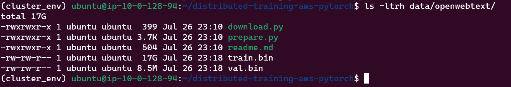
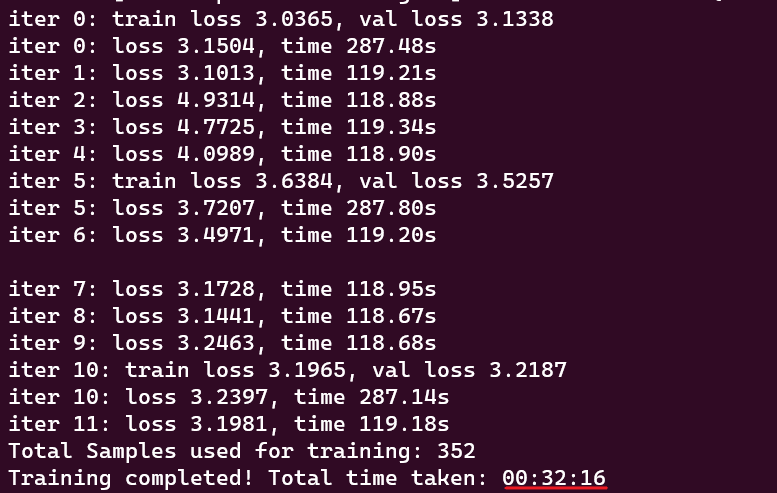
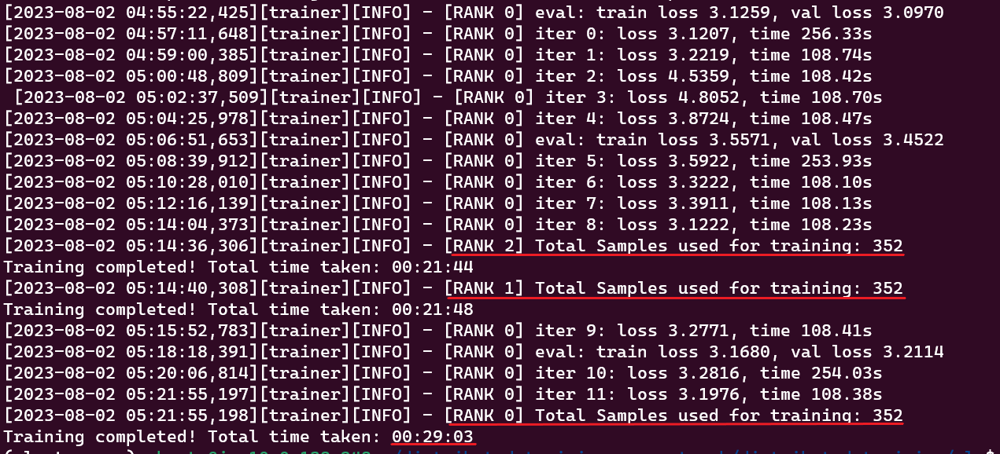

<p align="center">
  
</p>

# Distributed Training on AWS with Pytorch 

© Copyright 2023, Intel Corporation


## Introduction
This repository shows how to fine-tune GPT2-small (124M) model on [OpenWebText dataset](https://skylion007.github.io/OpenWebTextCorpus/) in a distributed setting on 3rd Gen or 4th Gen Xeon CPUs. [nanoGPT](https://github.com/karpathy/nanoGPT) was used for GPT2 implementation and [OpenWebText dataset](https://huggingface.co/datasets/Skylion007/openwebtext) was downloaded from HuggingFace Hub.  

## Table of Contents
1. [Overview](#overview)
2. [Prerequisites](#prerequisites)
3. [Setting things up](#setup)
4. [Fine-tuning on Single CPU](#fine-tuning-on-single-cpu)
5. [Preparing for Distributed training](#preparing-for-distributed-training)
6. [Fine-tuning on Multiple CPUs](#fine-tuning-on-multiple-cpus)

## 1. Overview
LLMs (Large Language Models) are everywhere, but in many cases, you don't need the full capability of the GPT-4 model. Additionally, when you have a specific task at hand, the performance of the GPT-4 model might not be optimal. Often, fine-tuning a small LLM on your dataset is sufficient. In this guide, you will learn how to fine-tune the GPT2-small model on a cluster of Xeon CPUs on AWS.

Here are the steps to accomplish the fine-tuning GPT2-small model on OpenWebtext dataset:
1. **Install dependencies**: Begin by installing the necessary dependencies and ensure that all required libraries and tools are setup correctly.
2. **Download and prepare the dataset**: Obtain the OpenWebText dataset from HuggingFace Hub. Preprocess and format the data appropriately for compatibility with nanoGPT implementation. Optionally, save both the raw and preprocessed data in S3 Bucket.
3. **Fine-tune on Single CPU**: Test the fine-tuning script on a single CPU to understand the basic workflow and to make all dependencies are installed correctly.
4. **Set things up for Distributed Training**: Configuring the necessary infrastructure like EC2 instances, Security Groups, etc. for distributed training on multiple CPUs. This is the most important step.
5. **Fine-tune on Multiple CPUs**: Once the distributed training environment is ready, perform fine-tuning on the cluster of Xeon CPUs to train the model quickly.

[Back to Table of Content](#table-of-contents)


## 2. Prerequisites

Before proceeding, ensure you have an AWS account and the necessary permissions to create AMIs, security groups, and launch multiple EC2 instances.

For fine-tuning, in this guide, we used 3x [*m6i.4xlarge* instances](https://aws.amazon.com/ec2/instance-types/m6i/) with an Ubuntu 22.04 AMI and 250 GB storage each. However, if you have access to 4th Gen Sapphire Rapids Xeon CPUs ([*R7iz*](https://aws.amazon.com/ec2/instance-types/r7iz/)) on AWS, you can also use those for fine-tuning. To maximize performance during fine-tuning, we recommend using `bfloat16` precision, especially when using 4th Gen Xeon CPUs.

To verify if the AMX instruction set is supported on your system, you can run the following command in the terminal:

```bash
lscpu | grep amx
```

If your system supports the AMX instruction set, you should see the following flags:

```
amx_bf16 amx_tile amx_int8
```

These flags indicate that the AMX instructions are available on your system, which is essential for leveraging AMX optimizations during fine-tuning or other computations.

By following this guide, you will be able to effectively fine-tune your model on either [*m6i.4xlarge* instances](https://aws.amazon.com/ec2/instance-types/m6i/) or the newer 4th Gen Xeon [*R7iz*](https://aws.amazon.com/ec2/instance-types/r7iz/) CPUs.

[Back to Table of Content](#table-of-contents)


## 3. Setup

To set up the necessary environment for fine-tuning the GPT2-small model, follow these steps:

Update the package manager and install [tcmalloc](https://github.com/google/tcmalloc) for extra performance

```bash
sudo apt update
sudo apt install libgoogle-perftools-dev unzip -y
```

(Optional) If you wish to upload your dataset and processed files to S3, you can install AWS CLI. First, download and unzip the AWS CLI package:
```bash
curl "https://awscli.amazonaws.com/awscli-exe-linux-x86_64.zip" -o "awscliv2.zip" && unzip awscliv2.zip
```

Then, install AWS CLI using the provided script:
```bash
sudo ./aws/install
```

Ensure that the AWS CLI was installed properly by running the following:
```bash
aws --version
```

If you see the version details, that means you have succesfully installed AWS CLI. Remember to clean thing up after installation
```bash
rm -r awscliv2.zip aws
```

Lets configure our AWS CLI
```bash
aws configure
```

Now lets set up the environment for fine-tuning GPT. First, download and install `conda` based on your operating system. You can find the download instructions [here](https://www.anaconda.com/download#downloads). For Linux, use the following commands:

```bash
wget https://repo.anaconda.com/archive/Anaconda3-2023.07-1-Linux-x86_64.sh
bash ./Anaconda3-2023.07-1-Linux-x86_64.sh
```

Once conda is installed, create a virtual environment and activate it.

```bash
conda create -n cluster_env python=3.10
conda activate cluster_env
```

These steps will prepare the necessary environment and tools for the subsequent fine-tuning process.

[Back to Table of Content](#table-of-contents)


## 4. Fine-tuning on Single CPU

To begin the fine-tuning process in a single CPU, follow these steps:

Clone this repo and install its dependencies:

```bash
git clone https://github.com/intel-innersource/frameworks.ai.infrastructure.distributed-training-aws-pytorch.git distributed-training-aws-pytorch
cd distributed-training-aws-pytorch/distributed-training/nlp
pip install -r requirements.txt
```

Theres one more python package that we need to download and install separately. Its called *oneCCL*, download the **appropriate** wheel file from [here](https://www.intel.com/content/dam/develop/external/us/en/documents/ipex/whl-stable-cpu.html) and install it using the following commands:

```bash
wget https://intel-extension-for-pytorch.s3.amazonaws.com/torch_ccl/cpu/oneccl_bind_pt-1.13.0%2Bcpu-cp310-cp310-linux_x86_64.whl
pip install oneccl_bind_pt-1.13.0+cpu-cp310-cp310-linux_x86_64.whl
```

don't forget to delete the wheel file after installation
```bash
rm oneccl_bind_pt-1.13.0+cpu-cp310-cp310-linux_x86_64.whl
```

Next, download and process the OpenWebText dataset by running the following command:

```bash
python data/openwebtext/prepare.py
```

> **Note**: The script can also upload both the raw data and processed files to S3. Ensure that you have prepared a S3 bucket before running this script. You also need to updated the bucket name in the code. To enable the upload feature, pass `--upload-to-s3` to `prepare.py` file.

By default, the `prepare.py` script will download a subset of 10K training samples from [Ankursingh/openwebtext_10K](https://huggingface.co/datasets/Ankursingh/openwebtext_10K), allowing you to check the functionality of ICOM without waiting for the entire dataset to be processed. 

To dowload the complete dataset append `--full` to `prepare.py` script. This complete dataset takes up approximately 54GB in the Hugging Face `.cache` directory and contains about 8 million documents (8,013,769).

```bash
python data/openwebtext/prepare.py --full
```

During the tokenization process, the storage usage might increase to around 120GB. The entire process can take anywhere from 1 to 3 hours, depending on your CPU's performance.

Upon successful completion of the script, two files will be generated:

1. `train.bin`: This file will be approximately 17GB (~9B tokens) in size.
2. `val.bin`: This file will be around 8.5MB (~4M tokens) in size.

You should be able to run `ls -ltrh data/openwebtext/` and see the following output:

 


For future use on other systems, you can directly download the processed BIN files from S3 by executing `download.py` script. Follow the previous steps, and instead of running `prepare.py`, execute the `download.py` script. Make sure to update the S3 bucket name and processed files path in `download.py` file.

Once, you have the BIN files ready, generate the `accelerate` config file by running the following command:

```bash
accelerate config --config_file ./single_config.yaml
```

When you run the above command,you will be prompted to answer a series of questions to configure the training process. Here's a step-by-step guide on how to proceed:

```bash
In which compute environment are you running?
Please select a choice using the arrow or number keys, and selecting with enter
 ➔  This machine
    AWS (Amazon SageMaker)
```

Select **This machine** as we are not using Amazon SageMaker. Next, 

```bash
Which type of machine are you using?
Please select a choice using the arrow or number keys, and selecting with enter
 ➔  No distributed training
    multi-CPU
    multi-XPU
    multi-GPU
    multi-NPU
    TPU
```

Since, we are running the script on a single machine, select **No distributed training**. Next, you will be prompted to answer a bunch of yes/no questions. Most of them are pretty self explainatory. At the very end, you will be asked to select mixed precision

```bash
Do you wish to use FP16 or BF16 (mixed precision)?
Please select a choice using the arrow or number keys, and selecting with enter
    no   
 ➔  fp16
    bf16
    fp8
```

Select `bf16` on 4th Gen Xeon CPUs otherwise select `fp16`. This is what the final output should look like.


```bash
------------------------------------------------------------------------------------------------------------------------------------------
In which compute environment are you running?
This machine
------------------------------------------------------------------------------------------------------------------------------------------
Which type of machine are you using?
No distributed training
Do you want to run your training on CPU only (even if a GPU / Apple Silicon device is available)? [yes/NO]:yes
Do you want to use Intel PyTorch Extension (IPEX) to speed up training on CPU? [yes/NO]:yes
Do you wish to optimize your script with torch dynamo?[yes/NO]:NO
Do you want to use DeepSpeed? [yes/NO]: NO
------------------------------------------------------------------------------------------------------------------------------------------
Do you wish to use FP16 or BF16 (mixed precision)?
bf16
```
This will generate a config file and save it as `single_config.yaml` in your CWD. 

We are now ready to start fine-tuning the GPT-2 Small model. To start the finetuning process run `main.py` script. But instead of running the `main.py` file directly, we will use the `accelerate launch` command along with the generated config file. 

```bash
accelerate launch --config_file ./single_config.yaml main.py
```

This command will initiate the fine-tuning process, utilizing the settings specified in the `single_config.yaml` file.

> **Note**: By default, `main.py` uses the `gpt2_train_cfg.yaml` configuration file. You can review the file for `batch_size`, `device`, `max_iters`, etc. and make changes as needed. If you prefer to use a different configuration file, say `new_config.yaml`, you can pass it to `main.py` using the `--config-name` flag as follows: 

```bash
accelerate launch --config_file ./single_config.yaml main.py --config-name new-config.yaml
```

> **Note**: Accelerate by default will used appropiate number of cores for maximum performance. For experimental reasons, to control the number of threads , set `--num_cpu_threads_per_process` to the number of cores. For example, if you want to run the script with only two cores:

```bash
accelerate launch --config_file ./single_config.yaml --num_cpu_threads_per_process 8 main.py
```

The script will train the model for a specified number of `max_iters` iterations and perform evaluations at regular `eval_interval`. If the evaluation score surpasses the previous model's performance, the current model will be saved in the current working directory (CWD) under the name `ckpt.pt`. It will also save the snapshot of the train progress under the name `snapshot.pt`. You can easily customize these settings by modifying the values in the `gpt2_train_cfg.yaml` file.

We are training for 10 iterations only. After successful completion, the model was trained on 352 samples, taking approximately 32 minutes. However, considering the total of ~8.8 million training samples, the current training speed might result in days of training.



> **Note**: In this fine-tuning process, we have opted not to use the standard PyTorch DataLoader. Instead, we have implemented a `get_batch` method that returns a batch of random samples from the dataset each time it is called. This implementation has been directly copied from the nanoGPT implementation, and we have endeavored to keep the codebase as close to the original implementation as possible, with minimal changes. </br> Due to this specific implementation, we do not have the concept of epochs in the training process. Instead, we are using iterations to handle the training process. Each iteration fetches a batch of random samples, allowing us to perform fine-tuning without relying on the standard DataLoader and its epoch-based approach.</br> By maintaining this implementation and working closely with the nanoGPT codebase, we aim to ensure consistency and reduce any potential complications that could arise from significant modifications.


Next, we need to generate a new `accelerate` config for multi-CPU setup. Run the following command:
```bash
accelerate config --config_file ./multi_config.yaml
```

```bash
------------------------------------------------------------------------------------------------------------------------------------------
In which compute environment are you running?
This machine
------------------------------------------------------------------------------------------------------------------------------------------
Which type of machine are you using?
multi-CPU
How many different machines will you use (use more than 1 for multi-node training)? [1]: 3
------------------------------------------------------------------------------------------------------------------------------------------
What is the rank of this machine?
0
What is the IP address of the machine that will host the main process? xxx.xxx.xxx.xxx
What is the port you will use to communicate with the main process? 29500
Are all the machines on the same local network? Answer `no` if nodes are on the cloud and/or on different network hosts [YES/no]: no
What rendezvous backend will you use? ('static', 'c10d', ...): static
Do you want to use Intel PyTorch Extension (IPEX) to speed up training on CPU? [yes/NO]:yes
Do you wish to optimize your script with torch dynamo?[yes/NO]:NO
How many CPU(s) should be used for distributed training? [1]:1
------------------------------------------------------------------------------------------------------------------------------------------
Do you wish to use FP16 or BF16 (mixed precision)?
bf16
```

When configuring the multi-CPU setup using `accelerate config`, you will be prompted with several questions. To select the appropriate answers based on your environment, consider the following pointers:

- `How many different machines?`: Enter the number of EC2 instances you will be using. For example, if you have three EC2 instances (including the master node), enter "3" in this step.

- `IP address of the machine`: Provide the private IP address of the machine where you are running the `accelerate launch` command. You can find the private IP address by running the following command on the machine:

  ```bash
  hostname -i
  ```

- `How many CPUs?`: Specify the number of CPU sockets available on each machine. Generally, each machine will have only one CPU socker. However, in the case of bare metal instances, you may have two CPU sockets per instance. Enter the appropriate number based on your instance configuration.


This will generate a new config file named `multi_config.yaml` in your current working directory. Before creating an Amazon Machine Image (AMI) from this volume, make sure to delete the `snapshot.pt` file. If this file exists, the `main.py` script will resume training from the snapshot, which might not be desired when creating an AMI.

```bash
rm snapshot.pt
```

[Back to Table of Content](#table-of-contents)


## 5. Preparing for Distributed training

Now that we have this running in a single system, lets try to run it on multiple systems. To prepare for distributed training and ensure a consistent setup across all systems, follow these steps:

1. **Create an AMI**: Start by creating an Amazon Machine Image (AMI) from the existing instance where you have successfully run the fine-tuning on a single system. This AMI will capture the entire setup, including the dependencies, configurations, codebase, and dataset. To create an AMI, refer [Create a Linux AMI from an instance](https://docs.aws.amazon.com/AWSEC2/latest/UserGuide/creating-an-ami-ebs.html#:~:text=EBS%20volumes.-,Create%20a%20Linux%20AMI%20from%20an%20instance,-You%20can%20create).

2. **Security Group**: While waiting for the AMI creation, let's continue by creating a security group that enables communication among the member nodes. This security group should be configured to allow inbound and outbound traffic on the necessary ports for effective communication between the master node and the worker nodes.

    In the security group configuration, ensure that you have allowed *all* traffic originating from the security group itself. This setting allows seamless communication between the instances within the security group.

    Please refer to the following screenshot as an example:

    

    By setting up the security group in this manner, you ensure that all necessary traffic can flow between the master node and the worker nodes during distributed training.

3. **Launch new instances**: Use the created AMI to launch new instances, specifying the desired number of instances based on the number of systems you want to use for distributed training. This ensures that all the instances have the same environment and setup. To initiate new EC2 instances, there are two options available: using the AWS console or AWS CLI. If you have AWS CLI configured, you can launch instances by executing the following command:

```bash
aws ec2 run-instances --image-id ami-xxxxxxxx --count 2 --instance-type m6i.4xlarge --key-name <MyKeyPair> --security-group-ids sg-xxxxxxxx --subnet-id subnet-xxxxxx
```

Alternatively, if you don't have AWS CLI configured, you can utilize the AWS console for this purpose.

4. **Passwordless SSH**: Set up passwordless SSH from the master node to all the worker nodes. To enable password-less SSH, configure the master instance's SSH public key to be authorized on all other nodes. This will ensure SSH access without prompts between the master and worker nodes. To enable passwordless SSH, follow these steps:

    1. **Verify SSH Access**: First, check if you can SSH into the other nodes from the master node. Use the private IP address and the appropriate username for each node.

        ```bash
        ssh <username>@<ip-address>
        ```

        Successful SSH connections will indicate that the inbound rules of the security group are correctly set up. In case of any issues, check the network settings.

    2. **Generate SSH Key Pair**: On the master node, run the following command to generate an SSH key pair:

        ```bash
        ssh-keygen
        ```

        You will be prompted to enter a passphrase for the key. You can choose to enter a passphrase or leave it blank for no passphrase. For simplicity in this guide, it is recommended to leave it blank. The key pair will be generated and saved in the `~/.ssh` directory, with two files: `~/.ssh/id_rsa` (private key) and `~/.ssh/id_rsa.pub` (public key). For security, set appropriate permissions on the private key:

        ```bash
        chmod 600 ~/.ssh/id_rsa
        ```

    3. **Propagate the Public Key to Remote Systems**: To transfer the public key to the remote hosts, use the `ssh-copy-id` command. If password authentication is currently enabled, this is the easiest way to copy the public key:

          ```bash
          ssh-copy-id <username>@<private-ip-address>
          ```

          This command will copy the public key to the specified remote host. You will have to run this command from the master node to copy the public key to all other nodes.

    4. **Verify Passwordless SSH**: After copying the public key to all nodes, verify that you can connect using the key pair:

          ```bash
          ssh <username>@<private-ip-address>
          ```

          If you can successfully log in without entering a password, it means passwordless SSH is set up correctly.

    By following above steps, you will establish passwordless SSH between the master node and all worker nodes, ensuring smooth communication and coordination during distributed training. If you encounter any difficulties, additional information can be found [here](https://www.redhat.com/sysadmin/passwordless-ssh).

Next, to continue setting up the cluster, you will need to edit the SSH configuration file located at `~/.ssh/config` on the master node. The configuration file should look like this:

```plaintext
Host 10.0.*.*
   StrictHostKeyChecking no

Host node1
    HostName 10.0.xxx.xxx
    User ubuntu

Host node2
    HostName 10.0.xxx.xxx
    User ubuntu
```

The `StrictHostKeyChecking no` line disables strict host key checking, allowing the master node to SSH into the worker nodes without prompting for verification.

With these settings, you can now use `ssh node1` or `ssh node2` to connect to any node without any additional prompts.

Additionally, on the master node, you will create a host file (`hosts`) that includes the names of all the nodes you want to include in the training process, as defined in the SSH configuration above. Use `localhost` for the master node itself as you will launch the training script from the master node. The `hosts` file will look like this:

```plaintext
localhost
node1
node2
```

This setup will allow you to seamlessly connect to any node in the cluster for distributed training.

[Back to Table of Content](#table-of-contents)


## 6. Fine-tuning on Multiple CPUs

Before beginning the fine-tuning process, it is essential to update the `machine_rank` value on each machine. Follow these steps for each worker machine:

1. SSH into the worker machine.
2. Locate and open the `multi_config.yaml` file.
3. Update the value of the `machine_rank` variable in the file. Assign the rank to the worker nodes starting from 1.
   - For the master node, set the rank to 0.
   - For the first worker node, set the rank to 1.
   - For the second worker node, set the rank to 2.
   - Continue this pattern for additional worker nodes.

By updating the `machine_rank` accordingly, you ensure that each machine is correctly identified within the distributed training setup. This is crucial for the successful execution of the fine-tuning process.

To train PyTorch models in a distributed setting on Intel hardware, we utilize Intel's MPI (Message Passing Interface) implementation. This implementation provides flexible, efficient, and scalable cluster messaging on Intel® architecture. The Intel® oneAPI HPC Toolkit includes all the necessary components, including `oneccl_bindings_for_pytorch`, which is installed alongside the MPI toolset.

To use `oneccl_bindings_for_pytorch`, you simply need to source the environment by running the following command:

```bash
oneccl_bindings_for_pytorch_path=$(python -c "from oneccl_bindings_for_pytorch import cwd; print(cwd)")
source $oneccl_bindings_for_pytorch_path/env/setvars.sh
```

This command sets up the environment variables required for utilizing `oneccl_bindings_for_pytorch` and enables distributed training using Intel MPI. 

> **Note**: In a distributed setting, `mpirun` can be used to run any program, not just for distributed training. It allows you to execute parallel applications across multiple nodes or machines, leveraging the capabilities of MPI (Message Passing Interface).

Finally, it's time to run the fine-tuning process on multi-CPU setup. Execute the following command:
```bash
mpirun -f ~/hosts -n 3 -ppn 1 -genv LD_PRELOAD="/usr/lib/x86_64-linux-gnu/libtcmalloc.so" accelerate launch --config_file ./multi_config.yaml --num_cpu_threads_per_process 8 main.py 
```

The `mpirun` command runs the fine-tuning process on multiple-machine (-n 3) with one process per machine (-ppn 1). We set the number of OpenMP threads to 16 (--num_cpu_threads_per_process 16) and used tcmalloc for improved performance (-genv LD_PRELOAD="/usr/lib/x86_64-linux-gnu/libtcmalloc.so"). 

The `mpirun` command you provided runs the fine-tuning process on multiple machines with specific configurations. Here are some important points to consider when deciding the values for various `mpirun` parameters:
- `-n`: This parameter represents the number of CPUs or nodes. Typically, it is set to the number of nodes you are using. However, in the case of bare metal instances with two CPUs per board, you would use `2n` to account for the multiple CPUs on each node.
- `-ppn`: The "process per node" parameter determines how many training jobs you want to start on each CPU or node. If you set `-ppn` to 3, for example, it means that three instances of the command `accelerate launch --config_file ./multi_config.yaml main.py` will be executed on each CPU or node. If you are not sure, its recommended to use 1. 
- `-genv`: This argument allows you to set an environment variable that will be applied to all processes. In your case, you used it to set the `LD_PRELOAD` environment variable to control the number of cores that PyTorch will utilize.
- `num_cpu_threads_per_process`: The `num_cpu_threads_per_process` argument specifies the number of CPU cores that PyTorch will utilize. If you have set `-ppn` to 2 (indicating two training jobs per CPU or node), you may want to divide the total number of cores available by two and use that value as the number of threads for each training job.

> **Note**:  When utilizing deep learning for intensive tasks, ensure that you configure your software to utilize only the physical cores of your processor. This will help optimize performance and computational efficiency during the training process.

Consider these factors when determining the values for `mpirun` parameters to ensure optimal performance and resource utilization in your distributed training setup.

Here is what the final output for distributed training would look like. 



By adopting distributed training techniques, we witness a remarkable improvement in data processing efficiency. In approximately 29 minutes, we process three times the amount of data as compared to non-distributed training methods. Additionally, we get a lower loss value indicating better model generalization. This substantial speed boost and better generalization is a testament to the immense advantages of leveraging distributed training. Distributed training is of paramount importance in modern machine learning and deep learning scenarios. Its significance lies in the following aspects:

- Faster Training: As demonstrated in the output, distributed training significantly reduces the training time for large datasets. It allows parallel processing across multiple nodes, which accelerates the training process and enables efficient utilization of computing resources.

- Scalability: With distributed training, the model training process can easily scale to handle massive datasets, complex architectures, and larger batch sizes. This scalability is crucial for handling real-world, high-dimensional data.

- Model Generalization: Distributed training enables access to diverse data samples from different nodes, leading to improved model generalization. This, in turn, enhances the model's ability to perform well on unseen data.

Overall, distributed training is an indispensable technique that empowers data scientists, researchers, and organizations to efficiently tackle complex machine learning tasks and achieve superior results. With the knowledge of how to perform distributed training on Intel hardware, leveraging all the Intel's software goodness becomes a valuable asset in accelerating model training and optimizing performance.

One last thing before we sign-off. Now that we have trained our model lets try to generate some text. 

```bash
python sample.py --out_dir=.
```

The script will generate 3 sample text, each 100 tokens long. Here is the samples that we generated

```
The first is that the government has a good idea of what the government is doing, and it does it. I don't think the government has a good idea of what the government is doing. I don't think the government has a good idea of what the government is doing.

I think the government has a good idea of what the government is doing, and it does it.

The second is that the government is not the government. The government is not the government.

---------------


The other thing that I would like to point out is that I have been able to do a lot of business with the people I have met, and I have seen a lot of people in my life, and I have seen a lot of people that I have met, and I have seen a lot of people that I have met and I have seen a lot of people that I have met, and I have seen a lot of people that I have met, and I have seen a lot of
---------------


"I was in a situation where I was in a situation where I was in a situation where I was in a situation where I was in a situation where I was in a situation where I was in a situation where I was in a situation where I was in a situation where I was in a situation where I was in a situation where I was in a situation where I was in a situation where I was in a situation where I was in a situation where I was in a situation where I was
---------------
```

Indeed, during the fine-tuning process on the cluster of three 3rd Gen Xeon CPUs, we successfully trained the GPT2-Small model. The performance achieved is notable, and it is expected to be even better when utilizing 4th Gen Xeon CPUs. While there might be some token repetition observed at a certain point, it is important to remember that this module's primary focus was on the successful fine-tuning process and leveraging the capabilities of the Intel hardware effectively.

Ensure that you properly remove and clean up all the resources created during the course of following this module. To delete EC2 instances and a security group using the AWS CLI, you can use the following commands:

1. Delete EC2 instances:
```bash
aws ec2 terminate-instances --instance-ids <instance_id1> <instance_id2> ... <instance_idN>
```
Replace `<instance_id1>`, `<instance_id2>`, ..., `<instance_idN>` with the actual instance IDs you want to terminate. You can specify multiple instance IDs separated by spaces.

2. Delete Security Group:
```bash
aws ec2 delete-security-group --group-id <security_group_id>
```
Replace `<security_group_id>` with the ID of the security group you want to delete.

Please be cautious when using these commands, as they will permanently delete the specified EC2 instances and security group. Double-check the instance IDs and security group ID to avoid accidental deletions.

[Back to Table of Content](#table-of-contents)

